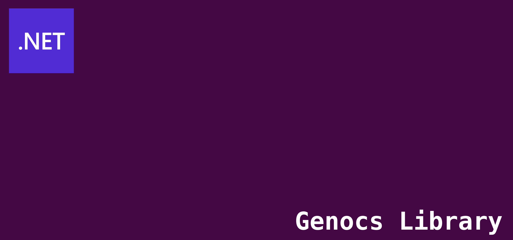

<!-- PROJECT SHIELDS -->
[![License][license-shield]][license-url]
[![Build][build-shield]][build-url]
[![Packages][package-shield]][package-url]
[![Downloads Prev][downloads-prev-shield]][downloads-prev-url]
[![Downloads][downloads-shield]][downloads-url]
[![Contributors][contributors-shield]][contributors-url]
[![Forks][forks-shield]][forks-url]
[![Stargazers][stars-shield]][stars-url]
[![Issues][issues-shield]][issues-url]
[![Discord][discord-shield]][discord-url]
[![Gitter][gitter-shield]][gitter-url]
[![Twitter][twitter-shield]][twitter-url]
[![Twitterx][twitterx-shield]][twitterx-url]
[![LinkedIn][linkedin-shield]][linkedin-url]

[license-shield]: https://img.shields.io/github/license/Genocs/clean-architecture-template?color=2da44e&style=flat-square
[license-url]: https://github.com/Genocs/clean-architecture-template/blob/main/LICENSE
[build-shield]: https://github.com/Genocs/clean-architecture-template/actions/workflows/build_and_test.yml/badge.svg?branch=main
[build-url]: https://github.com/Genocs/clean-architecture-template/actions/workflows/build_and_test.yml
[package-shield]: https://img.shields.io/badge/nuget-v.3.1.0-blue?&label=latests&logo=nuget
[package-url]: https://github.com/Genocs/clean-architecture-template/actions/workflows/build_and_test.yml
[downloads-prev-shield]: https://img.shields.io/nuget/dt/Genocs.CleanArchitectureTemplate.svg?color=2da44e&label=downloads%20prev&logo=nuget
[downloads-prev-url]: https://www.nuget.org/packages/Genocs.CleanArchitectureTemplate
[downloads-shield]: https://img.shields.io/nuget/dt/Genocs.CleanArchitecture.Template.svg?color=2da44e&label=downloads&logo=nuget
[downloads-url]: https://www.nuget.org/packages/Genocs.CleanArchitecture.Template
[contributors-shield]: https://img.shields.io/github/contributors/Genocs/clean-architecture-template.svg?style=flat-square
[contributors-url]: https://github.com/Genocs/clean-architecture-template/graphs/contributors
[forks-shield]: https://img.shields.io/github/forks/Genocs/clean-architecture-template?style=flat-square
[forks-url]: https://github.com/Genocs/clean-architecture-template/network/members
[stars-shield]: https://img.shields.io/github/stars/Genocs/clean-architecture-template.svg?style=flat-square
[stars-url]: https://img.shields.io/github/stars/Genocs/clean-architecture-template?style=flat-square
[issues-shield]: https://img.shields.io/github/issues/Genocs/clean-architecture-template?style=flat-square
[issues-url]: https://github.com/Genocs/clean-architecture-template/issues
[discord-shield]: https://img.shields.io/discord/1106846706512953385?color=%237289da&label=Discord&logo=discord&logoColor=%237289da&style=flat-square
[discord-url]: https://discord.com/invite/fWwArnkV
[gitter-shield]: https://img.shields.io/badge/chat-on%20gitter-blue.svg
[gitter-url]: https://gitter.im/genocs/
[twitter-shield]: https://img.shields.io/twitter/follow/genocs?color=1DA1F2&label=Twitter&logo=Twitter&style=flat-square
[twitter-url]: https://twitter.com/genocs
[linkedin-shield]: https://img.shields.io/badge/-LinkedIn-black.svg?style=flat-square&logo=linkedin&colorB=555
[linkedin-url]: https://www.linkedin.com/in/giovanni-emanuele-nocco-b31a5169/
[twitterx-shield]: https://img.shields.io/twitter/url/https/twitter.com/genocs.svg?style=social
[twitterx-url]: https://twitter.com/genocs


<p align="center">
    
</p>

# Clean Architecture Template 
Built for .NET8. It incorporates the most essential Packages your projects will ever need. Follows Clean Architecture Principles.

The template can be used with the `dotnet new` command or with the `Visual Studio 2022` or `Visual Studio Code` IDEs.

## Goals

This is an Application Template built to help you create LOB applications. It follows the Clean Architecture Principles and built on Domain-Driven-Design. This tool is useful to increases productivity on developing your next microservices.
The template allows you to use different databases and enterprise service bus.

### Databases supported:
- InMemoryDB (for development purpose)
- SqlServer
- MongoDB


### Enterprise Service Bus libraries supported:
- Particular NServiceBus
- MassTransit
- Rebus

## Prerequisites
- [.NET 8.x](https://dotnet.microsoft.com/download/dotnet/8.0)

- [Visual Studio 2022](https://visualstudio.microsoft.com/vs/preview/vs2022/)(optional)
- [Visual Studio Code](https://code.visualstudio.com/download)(optional)
- [Rider](https://www.jetbrains.com/rider/)(optional)


## Getting Started

Open up your *Command Prompt* or *PowerShell* or "bash" and run the following command.

``` bash
# To clone the repository
git clone https://github.com/Genocs/clean-architecture-template
# To build the nuget package
nuget pack ./src/Package.Template.nuspec -NoDefaultExcludes -OutputDirectory ./out -Version 3.1.0
```


``` bash
# To install the template
dotnet new install Genocs.CleanArchitecture.Template
```

or, 

if you want to use a specific version of the template, 

use

``` bash
dotnet new install Genocs.CleanArchitecture.Template::3.1.0
```

This would install the `Genocs CleanArchitecture Template` globally on your machine.

For more details on getting started, [read the documentation](https://genocs-blog.netlify.app/library/)


Please check the [documentation](https://learn.microsoft.com/en-us/visualstudio/ide/how-to-locate-and-organize-project-and-item-templates?view=vs-2022) for more details. 


## How to create a project

Create, build, test and run:

``` bash
dotnet new -i Genocs.CleanArchitecture.Template
dotnet new cleanarchitecture -n {CompanyName.ProjectName.ServiceName}
cd {CompanyName.ProjectName.ServiceName}
dotnet build ./src/{CompanyName.ProjectName.ServiceName}.WebApi
dotnet build ./src/{CompanyName.ProjectName.ServiceName}.Worker

dotnet test
dotnet run ./src/{CompanyName.ProjectName.ServiceName}.WebApi
```


## How to build the package

To build the package run the following commands:

[Official Link](https://docs.microsoft.com/en-us/dotnet/core/tools/custom-templates)


``` bash
cd ./src
nuget pack
dotnet new u Genocs.CleanArchitecture.Template
dotnet new i ./out/Genocs.CleanArchitecture.Template.3.1.0.nupkg
dotnet new cleanarchitecture --help
dotnet new cleanarchitecture --name {MyCompany.MyProject} -d mongodb -sb particular
```


## Sample application

Run `dotnet new -i Genocs.CleanArchitecture.Template` then try the following commands.


``` bash
# Complete suite of use cases.
dotnet new cleanarchitecture --use-cases full

# Register account and get customer details.
dotnet new cleanarchitecture --use-cases basic

# Read only use cases
dotnet new cleanarchitecture --use-cases readonly
```


## Miscellaneous

Useful commands:

``` bash
# How to get the list of installed templates
dotnet new -u

dotnet --list
```
## Changelogs

View Complete [Changelogs](https://github.com/Genocs/clean-architecture-template/blob/main/CHANGELOGS.md).

## License

This project is licensed with the [MIT license](LICENSE).


## Community

- Discord [@genocs](https://discord.com/invite/fWwArnkV)
- Facebook Page [@genocs](https://facebook.com/Genocs)
- Youtube Channel [@genocs](https://youtube.com/c/genocs)


## Support

Has this Project helped you learn something New? or Helped you at work?
Here are a few ways by which you can support.

- ⭐ Leave a star!
- 🥇 Recommend this project to your colleagues.
- 🦸 Do consider endorsing me on LinkedIn for ASP.NET Core - [Connect via LinkedIn](https://www.linkedin.com/in/giovanni-emanuele-nocco-b31a5169/) 
- ☕ If you want to support this project in the long run, consider [buying me a coffee](https://www.buymeacoffee.com/genocs)!
  

[](https://www.buymeacoffee.com/genocs)

## Code Contributors

This project exists thanks to all the people who contribute. [Submit your PR and join the team!](CONTRIBUTING.md)

[](https://github.com/Genocs/clean-architecture-template/graphs/contributors)

## Financial Contributors

Become a financial contributor and help me sustain the project.

**Support the Project** on [Opencollective](https://opencollective.com/genocs)

<a href="https://opencollective.com/genocs"></a>


## Acknowledgements


